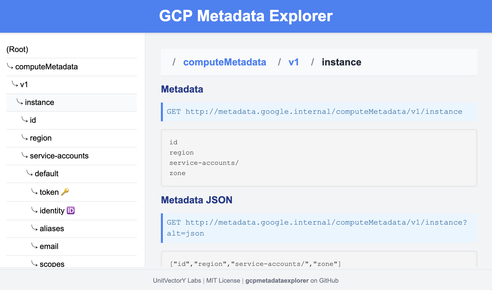

[](https://github.com/UnitVectorY-Labs/iapheaders/releases/latest) [](https://opensource.org/licenses/MIT) [](https://guide.unitvectorylabs.com/bestpractices/status/#active)

# gcpmetadataexplorer

A web-based interface for browsing and inspecting the GCP metadata server.

## Overview

`gcpmetadataexplorer` is a web application designed for deployment on GCP to explore data available from the GCP [metadata server](https://cloud.google.com/compute/docs/metadata/overview). The metadata server can be accessed at `http://metadata.google.internal/computeMetadata/v1` when running on a VM or container in GCP and is used to provide information about the instance, project, and service account. This application provides a user-friendly interface for browsing the metadata server and inspecting the data available including the various URLs for accessing metadata.



The purpose of this application is to provide a simple interface for developers to explore the GCP metadata server.  This is not intended for use in a production envirionment.  The GCP metadata server has several quirks when it comes to the query responses that are easily demonstrated with this application.  The service can return responses in plain text or JSON format, depending on the query parameters. Recursive queries can also be made at multiple levels returning various subsets of data.  The application allows for navigating this hierarchy showing what the various types of requests return as a response.

The metadata server is also capable of returning both GCP access tokens and identity tokens.  This functionality is disabled by default due to the security implications of accidentally exposing these tokens.  The application can be configured to allow access to these tokens through the interface but care should be taken to ensure that the application is not exposed to the public internet.

## Usage

The latest `gcpmetadataexplorer` Docker image is available for deployment from GitHub Packages at [ghcr.io/unitvectory-labs/gcpmetadataexplorer](https://github.com/UnitVectorY-Labs/gcpmetadataexplorer/pkgs/container/gcpmetadataexplorer).

You can easily deploy this application locally to test it out with the following command:

```bash
docker run -p 8080:8080 -e ALLOW_TOKENS=false ghcr.io/unitvectory-labs/gcpmetadataexplorer:v0.1.0
```

However, running outside of GCP all you will get is the "Error: Failed to fetch metadata from the metadata server" error.

## ⚠️ Security Warning ⚠️

The GCP metadata server is a powerful API that must not be exposed to the public internet. Improper use of this application could pose serious security risks. To ensure security, take precautions such as using [Identity-Aware Proxy](https://cloud.google.com/security/products/iap) (IAP) to restrict access.

Be aware of the potential security issues before enabling the `ALLOW_TOKENS` environment variable.

## Configuration

The application is configurable through environment variables. Below are the available configurations:

- `ALLOW_TOKENS`: Enables access to access tokens and identity tokens through the interface. This feature is disabled by default. Set to `true` to enable.
